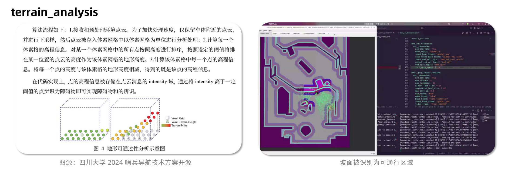

# nbut2025_sentry_nav

> [!NOTE] main分支将外部库作为子模块添加到当前仓库中

## 1.项目介绍

本项目是针对2025年机器人哨兵的ROS2开发项目，旨在实现机器人哨兵的自主导航、目标识别和攻击等功能。项目包含了多个功能模块，包括自瞄、导航、决策等。

本项目基于 [NAV2 导航框架](https://github.com/ros-navigation/navigation2),[pb2025_sentry_nav](https://github.com/SMBU-PolarBear-Robotics-Team/pb2025_sentry_nav)，在此基础上修改，适配自家哨兵。

### Navigation2框图


## 2.Quick Start

### 2.1 环境配置

- Ubuntu 22.04
- ROS: [Humble](https://docs.ros.org/en/humble/Installation/Ubuntu-Install-Debs.html)
- Ignition: [Fortress](https://gazebosim.org/docs/fortress/install_ubuntu/)
- Install [OpenVINO 2023.3](https://docs.openvino.ai/2025/get-started/install-openvino.html?PACKAGE=OPENVINO_BASE&VERSION=v_2023_3_0&OP_SYSTEM=LINUX&DISTRIBUTION=APT)
- Install [small_icp](https://github.com/koide3/small_gicp):

```bash
sudo apt install -y libeigen3-dev libomp-dev

git clone https://github.com/koide3/small_gicp.git
cd small_gicp
mkdir build && cd build
cmake .. -DCMAKE_BUILD_TYPE=Release && make -j
sudo make install
```

```bash
sudo apt install git-lfs
sudo pip install vcstool2
```


### 2.2 编译工作空间
```bash
rosdep install -r --from-paths src --ignore-src --rosdistro $ROS_DISTRO -y
```

```bash
colcon build --symlink-install --cmake-args -DCMAKE_BUILD_TYPE=Release --parallel-workers 10
```
> [!NOTE]
> 推荐使用 --symlink-install 选项来构建你的工作空间，因为该项目广泛使用了 launch.py 文件和 yaml 文件。这个构建参数会为那些非编译的源文件使用符号链接，这意味着当你调整参数文件时，不需要反复重建，只需要重新启动即可。

### 2.3 运行
参数均读取自配置文件 [node_params](./src/pb2025_sentry_bringup/params/node_params.yaml)。

#### 建图
> [!NOTE]
> 请自行替换 `<YOUR_WORLD_NAME>` 为你的 map, pcd 的文件名；替换 `<YOUR_PARAMS_FILE>` 为你的配置文件的**绝对路径**，如 [node_params](./src/pb2025_sentry_bringup/params/node_params.yaml)。

- 建图时将pcd_save_en设置为True

```bash
ros2 launch pb2025_nav_bringup rm_navigation_reality_launch.py slam:=True use_robot_state_pub:=True
```
#### 保存地图
- 保存栅格地图 `ros2 run nav2_map_server map_saver_cli -f <YOUR_MAP_NAME>  --ros-args -r __ns:=/red_standard_robot1`
- 保存pcd，将pcd_save_en设置为True

#### 导航
- 注意修改 `world` 参数为实际地图的名称

```bash
ros2 launch pb2025_sentry_bringup bringup.launch.py \
world:=<YOUR_PARAMS_FILE> \
use_rviz:=True
```


```bash
ros2 launch pb2025_nav_bringup rm_navigation_reality_launch.py \
world:=test1 \
slam:=False \
use_robot_state_pub:=True
```

如果关闭重定位，需手动发送map->odom,运行以下命令或者手动加initpose(纯惯性导航+避障)
```bash
ros2 run tf2_ros static_transform_publisher --frame-id map --child-frame-id odom --x 0 --y 0 --z 0 --roll 0 --pitch 0 --yaw 0 
```


## 3. 常用调试启动命令

> [!NOTE]
> 请自行替换 `<YOUR_WORLD_NAME>` 为你的 map, pcd 的文件名；替换 `<YOUR_PARAMS_FILE>` 为你的配置文件的**绝对路径**，如 [node_params](./src/pb2025_sentry_bringup/params/node_params.yaml)。

### 3.1 子模块

Camera

```bash
ros2 launch hik_camera_ros2_driver hik_camera_launch.py params_file:=<YOUR_PARAMS_FILE>
```

Serial

```bash
ros2 launch standard_robot_pp_ros2 standard_robot_pp_ros2.launch.py use_rviz:=True params_file:=<YOUR_PARAMS_FILE>
```

Vision

```bash
ros2 launch pb2025_vision_bringup rm_vision_reality_launch.py \
use_composition:=True \
use_rviz:=True \
params_file:=<YOUR_PARAMS_FILE>
```

Navigation

```bash
ros2 launch pb2025_nav_bringup rm_navigation_reality_launch.py \
world:=<YOUR_WORLD_NAME>  \
slam:=False
```

Behavior Tree

```bash
ros2 launch pb2025_sentry_behavior pb2025_sentry_behavior_launch.py params_file:=<YOUR_PARAMS_FILE>
```

### 3.2 Tools

Teleop gimbal

```bash
ros2 run teleop_gimbal_keyboard teleop_gimbal_keyboard
```

Convert .pcd to .pgm

```bash
ros2 launch pcd2pgm pcd2pgm_launch.py
```

Save map

```bash
ros2 run nav2_map_server map_saver_cli -f <YOUR_WORLD_NAME>
```

### 3.3 Rosbags

#### 3.3.1 Record

> [!TIP]
> 图像信息占用空间极大，若不需要录制图像信息，可删除 `front_industrial_camera/image` 和 `front_industrial_camera/camera_info`。建议降低 hik_camera_ros2_driver 参数中的相机帧率，以减少 rosbag 文件大小。

> [!NOTE]
> 本命令仅录制了传感器数据，没有直接录制 tf 信息，因此启动导航/视觉模块时，应设置 `use_robot_state_pub:=True`，以使用 joint_state 数据生成并发布整车 TF。

方法一：根据裁判系统数据自动触发录包

设置 [node_params.yaml](./src/pb2025_sentry_bringup/params/node_params.yaml) 中的 `standard_robot_pp_ros2.record_rosbag` 参数为 `True`，设置 `rosbag_recorder.topics` 为要录制的话题，裁判系统进入 5s 倒计时阶段时自动开启录制，进入比赛结算阶段时自动结束录制并保存。

方法二：命令行手动触发录包

```bash
source install/setup.zsh

ros2 bag record -o sentry_$(date +%Y%m%d_%H%M%S) \
/serial/gimbal_joint_state \
/livox/imu \
/livox/lidar \
/front_industrial_camera/image \
/front_industrial_camera/camera_info \
--compression-mode file --compression-format zstd -d 30
```

#### 3.3.2 Play

> [!NOTE]
> 使用 `--clock` 参数，以发布 rosbag 中的时间戳到 `/clock` 话题。这意味着运行其他算法节点时，应设置 `use_sim_time:=True`。

```bash
ros2 bag play <YOUR_ROSBAG>.bag --clock
```

Example:

```bash
ros2 launch pb2025_sentry_bringup bringup.launch.py \
world:=<YOUR_WORLD_NAME> \
use_composition:=False \
use_rviz:=True \
use_sim_time:=True \
use_hik_camera:=False \
use_robot_state_pub:=True
```


## 4.功能模块

### 4.1 坐标变化
通常情况下map->odom的坐标变换由重定位提供，一般不超过30Hz，为保证自瞄的实时性，引入gimbal_odom（IMU初始上电位置）作为中间层。
底盘正方向chassis->gimbal_odom的坐标变换由从电控端接收到的数据得到。
对于导航模块，需要fast_lio/point_lio提供odom->chassis的变换
虚拟坐标系fale_vel_transform固定朝向odom x正方向，nav2输出的速度是基于gimbal_yaw_fake的，然后这个速度传进fake_vel_transform再变换回真实的gimbal_yaw坐标系下。

loam 将里程计结果转换为标准话题格式

### 4.2 感知
坡面识别、动态障碍物感知与擦除 —— 使用 CMU 开源的 terrain_analysis


### 4.3 定位
- 建图模式下，map->odom由slam_toolbox维护，odom->chassis 由point_lio维护 ，建图时运行 point_lio 算法获得赛场的 3D 点云地图，为导航模式的重定位提供先验点云地图。同时 terrain_analysis 识别分割出障碍物，pointcloud_to_laserscan 将障碍物投影至 2D 的栅格地图，为后续导航模式提供路径规划地图。二者是同时构建的，它们具有相同的原点。
- 导航模式下 map-> odom由small_gicp_relocalization维护，odom->chassis由point_lio维护。small_gicp 重定位模块实现机器人在先验点云地图中的定位；感知模块识别坡面和障碍物，为规划和控制提供实时信息；导航模块中的全局规划器基于2D 栅格地图寻找由起点到达终点的可行路径，局部规划器追踪规划的路径，转化为对底盘的控制命令，实现机器人的移动。

#### 定位表现
- 相比于fast_lio，point_lio的定位精度更高，对剧烈运动导致的 IMU 饱和环境非常鲁棒，在高速旋转和撞击等极端情况下依然能保持正确的位姿估计。里程计足够稳定。
- 重定位直接调用了北极熊改进后的small_gicp，积分 0.5s 内的点云，再将积分后的点云输入 small_gicp 与先验点云图做匹配。但对于场上准备阶段周围环境扰动大的，重定位容易出现定不上的情况，而重定位失败就会导致整局导航失败。
对于重定位的改进，一方面是算法优化，例如先用kiss_matcher做粗匹配保存key_frame得到大致位置，再给small_gicp做先验地图的精匹配。
另一方面是获取到更多的点云特征，尤其是天花板的点云特征。如增加一个雷达，更改雷达的安装位置给一定的倾角。

### 规划与控制
直接调用了北极熊的pb_omni_pid_pursuit_controller

### 决策
当前chassis仅完成了根据电控发送的标识符导航到对应的目标点
尝试将chassis和自瞄gimbal的进行融合，实现追击
尝试接入行为树，实现更复杂的决策，同时增加了一个闭环反馈，效果更好

#### 行为树
- 黑板机制。黑板是一个全局的数据存储结构，用于在行为树的各个节点之间共享数据。每个节点可以通过定义的端口（port）从黑板中读取或写入数据。


## 5. 部署指南 已做的修改 
- 修改雷达ip，安装位置对应的描述文件，
- 启动livox驱动后，读/livox/imu的linear_acceler，修改到point_lio中的gravity和gravity_init(重力方向需取符号)

- 建图时将pcd_save改为True
- 实车上去掉了namespace
- 添加了对应的map和pcd文件
- 串口开启了debug方便调试
- 修改了默认旋转速度 init_spin_speed gicp参数global_leaf_size0.05
- use_sim_time: false     robot_radius    inflation_radius     cost_scaling_factor: 4.0
- 雷达屏蔽一定距离内的点云 pointlio参数blind
- 修改速度 controller smoother_server 最大速度和加速度最好保持一致。

## 6. 使用说明
- 导航和建图的时候初始位姿不要相差太大，不然重定位也拉不回来


## 7. 测试效果 存在问题 优化方向
- map -> odom 重定位容易飘 怎么平衡匹配速度和准度。目前用的是gicp，匹配基本不收敛，参数还有待调。

- fake_vel_transform时间戳未对齐，输出的cmd_vel相对与真实速度参考系变化剧烈时输出的速度存在延迟，并不是nav预期的轨迹跟踪效果。而humble版本的Twist类型不带时间戳，往后版本才使用TwistStamped，难以做时间戳同步。